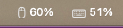

# BatteryBar

A lightweight macOS menu bar app that shows battery levels for connected Bluetooth devices (keyboards, mice, trackpads, headphones).



## Install

### Homebrew (recommended)

```bash
brew install marekaf/tap/batterybar
```

Then copy to Applications and launch:

```bash
cp -R $(brew --prefix)/Cellar/batterybar/*/BatteryBar.app /Applications/
open /Applications/BatteryBar.app
```

This builds from source (~60-90s) and avoids all Gatekeeper prompts.

### Manual download

1. Download `BatteryBar.zip` from the [latest release](../../releases/latest)
2. Unzip and move `BatteryBar.app` to `/Applications`
3. On first launch: right-click the app > Open (required for unsigned apps)

**Requirements:** macOS 13.0 or later (Apple Silicon and Intel).

> The app is not code-signed or notarized. macOS will block it on first launch —
> right-click the app and select "Open" to bypass Gatekeeper.
> If that doesn't work, remove the quarantine attribute first:
> ```
> xattr -cr /Applications/BatteryBar.app
> ```

## Features

- Individual status bar icons with battery percentage for each connected Bluetooth device
- AirPods individual battery levels (Left, Right, Case)
- Display modes: separate icons, combined icon, or percentages only
- Custom device names — rename any device from the menu
- Custom device icons — override the auto-detected icon per device
- Custom device order — reorder devices via move up/down
- Estimated battery time remaining per device
- Per-device visibility toggles — hide/show devices directly from the dropdown menu
- Configurable low battery threshold (5/10/15/20/25%)
- Low battery notifications via macOS native alerts
- Configurable refresh interval (10s, 30s, 60s, 120s)
- Manual refresh from the menu
- Launch at Login support
- Reads from both IOKit (classic Bluetooth) and CoreBluetooth (BLE) devices

## Building

```bash
./build.sh
```

Requires Xcode Command Line Tools. Builds a universal binary (arm64 + x86_64) targeting macOS 13.0+.

## Running

```bash
open BatteryBar.app
```

